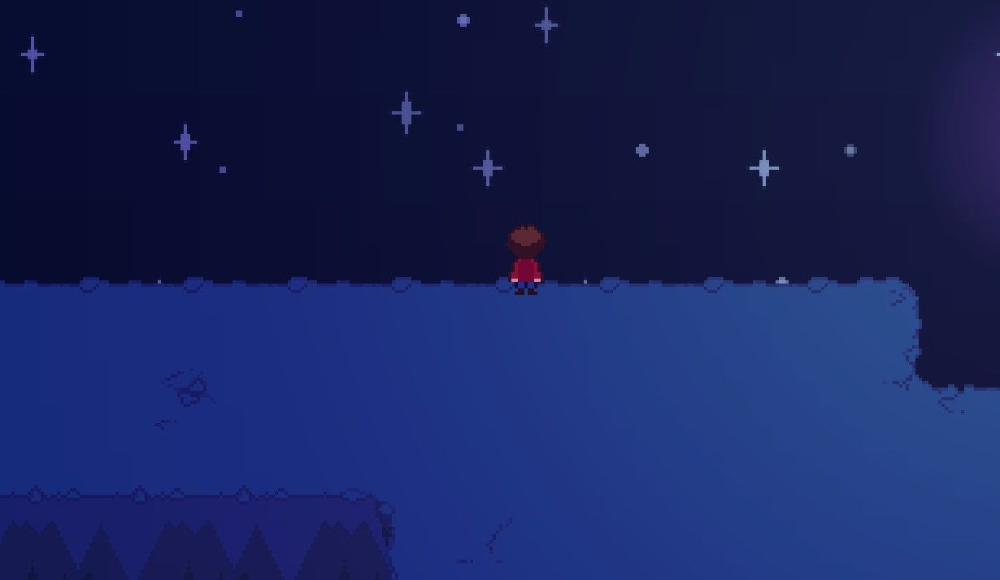
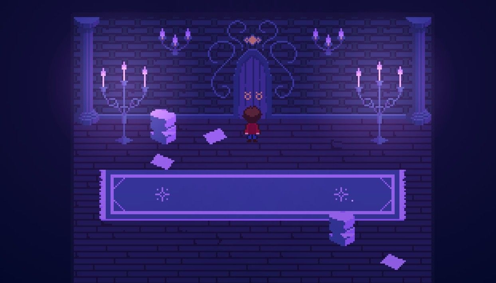
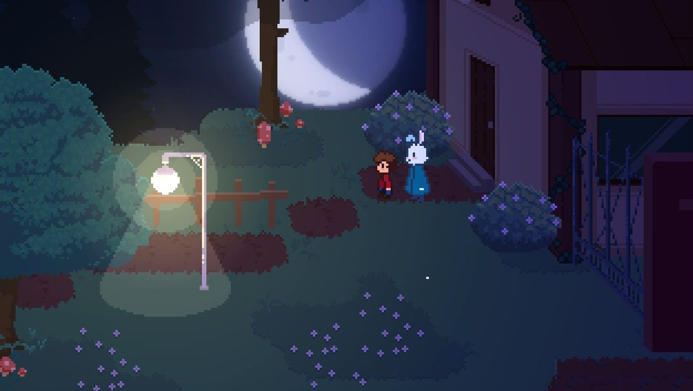
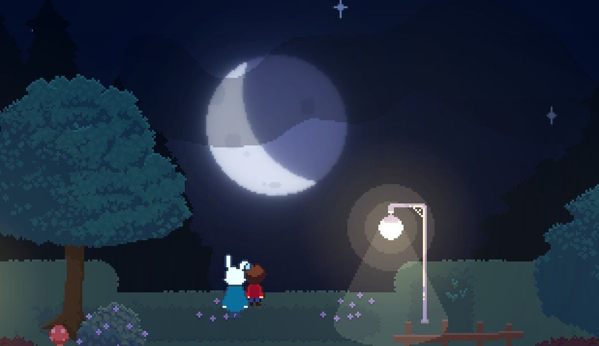
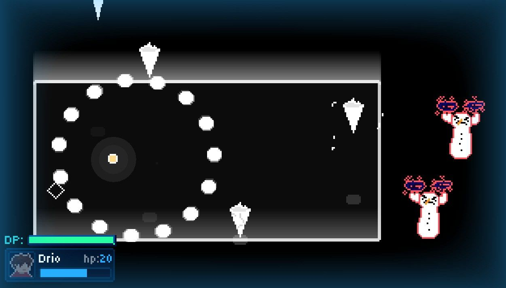
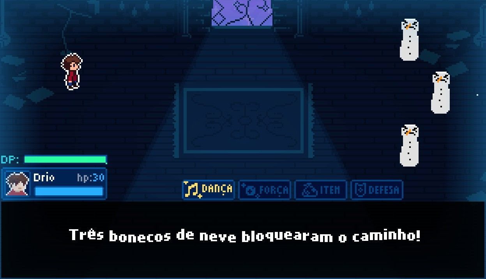
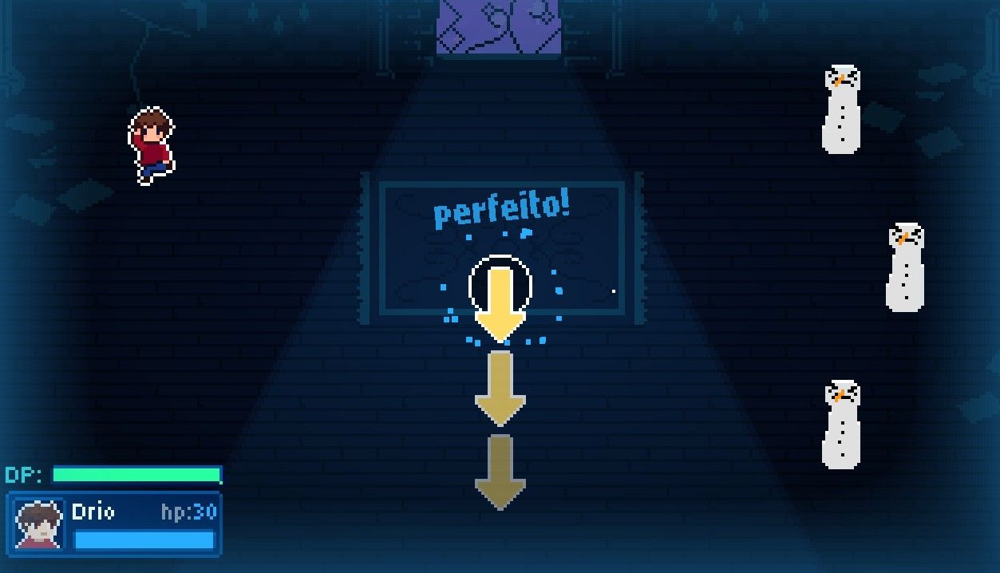

# Shards of Sorrow

**Shards of Sorrow** is a 2D narrative game developed in **GameMaker**.

The game explores themes of hope, loss, growth, and the struggles of broken people through exploration, storytelling, dialogue, and a rhythm-based battle system.

This repository contains the uncompressed source project of the game.

## 📸 Screenshots
## 📸 Screenshots

<p align="center">
  <kbd>
    
  </kbd>
  <kbd>
    
  </kbd>
</p>

<p align="center">
  <kbd>
    
  </kbd>
  <kbd>
    
  </kbd>
</p>

<p align="center">
  <kbd>
    
  </kbd>
  <kbd>
    
  </kbd>
</p>

<p align="center">
  <kbd>
    
  </kbd>
</p>

## 🎮 Features

- 2D exploration
- Narrative-driven gameplay
- Custom dialogue system
- Dialogue choices and text effects
- Custom cutscene system
- Rhythm-based battle system
- Enemy attack patterns
- Inventory system
- Custom camera system
- Parallax effects
- Custom shaders and visual effects
- Particle effects

## 🛠️ Built With

- **GameMaker**
- **GML (GameMaker Language)**
- **JSON**
- **Shaders / GLSL**

## 🔧 Technical Highlights

### Data-driven systems

Several systems use external JSON data instead of hardcoding all game content directly into the gameplay logic.

This includes data related to:

- Enemies
- Attacks
- Enemy attack patterns
- Dialogue
- Cutscenes
- Music

This approach makes it easier to modify and expand game content without having to rewrite the underlying systems.

### 💬 Dialogue System

The game features a custom dialogue system capable of handling:

- Dialogue IDs and external dialogue data
- Multiple speakers
- Dialogue choices
- Typewriter text
- Per-character text effects
- Text colors and animations
- Character-specific dialogue sounds

The system also uses a custom tag-based format (<effect> text </effect>) to control effects within dialogue text.

### ⚔️ Battle System

The battle system is built around a state-based architecture that manages different phases of combat, including menus, enemy turns, attacks, actions, transitions, and battle completion.

Enemy attacks and patterns are data-driven, and parts of the attack system are synchronized with music timing and BPM.

### 🎬 Cutscene System

Cutscenes are controlled through a custom command-based system.

Commands can control actions such as:

- Character movement
- Dialogue
- Camera behavior
- Sound playback
- Teleportation
- Sprite changes
- Object creation
- Waiting for specific events

This allows scenes to be authored as sequences of reusable commands rather than implementing every cutscene directly inside gameplay code.

### 📷 Camera System

The game uses a custom camera system with different behaviors for:

- Following targets
- Focusing on positions
- Moving between targets
- Fixed camera positions
- Camera shake

The system also supports parallax effects for layered environments.

### 🎨 Visual Effects

The project includes custom shaders and particle systems used for visual feedback, lighting, outlines, screen effects, and other gameplay effects.

## 📁 Project Structure

```text
datafiles/      → External game data in JSON
objects/        → Game objects and gameplay systems
rooms/          → Game rooms and environments
scripts/        → Reusable gameplay and utility code
sequences/      → Game sequences and cutscenes
shaders/        → Custom shaders
sounds/         → Audio assets
sprites/        → Visual assets
tilesets/       → Environment tilesets
```

## 📌 Project Status

**On hiatus.**

Development of Shards of Sorrow is currently paused while I work on another project, **Lou**.

Even while on hiatus, this repository remains available as a record of the game's development and the systems built throughout the project.

## 🌙 About the Project

Shards of Sorrow started as a personal project and gradually grew into a much larger game.

A major part of the project's development was learning through experimentation: systems were built, replaced, expanded, and refactored as my programming knowledge evolved.

Because of that, the codebase contains both older implementations and more recent approaches. The project represents not only the game itself, but also a significant part of my growth as a programmer and Game Developer.

---

**Created by [Evandro Grichok](https://github.com/evandrogrichok)**
